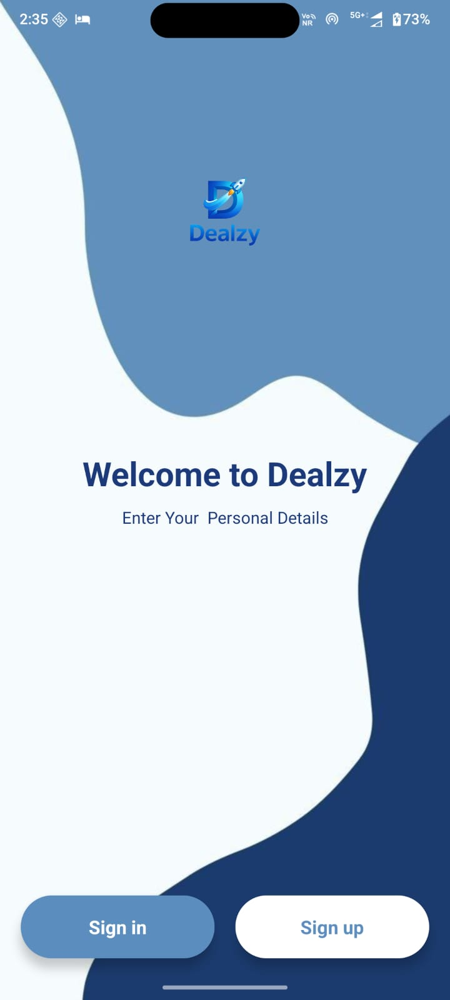
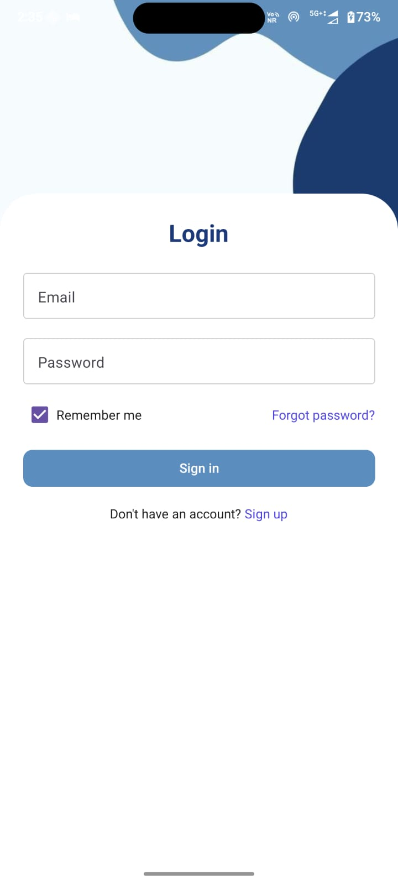
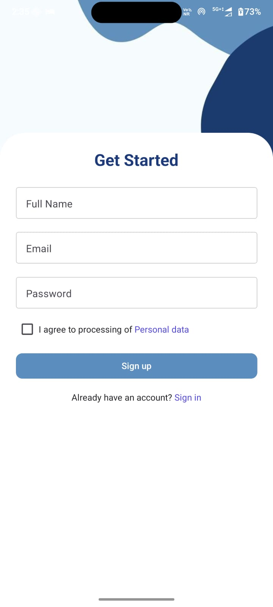
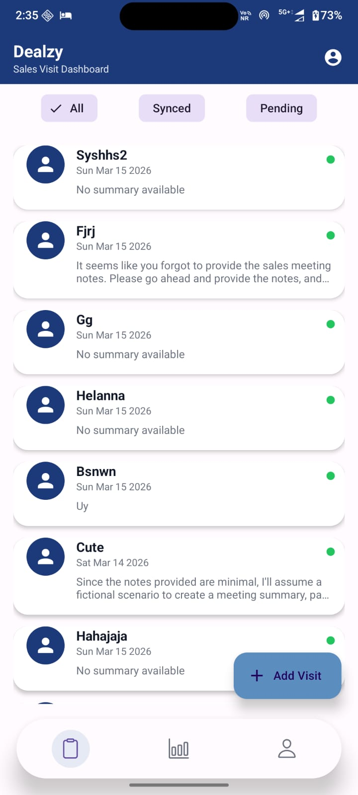
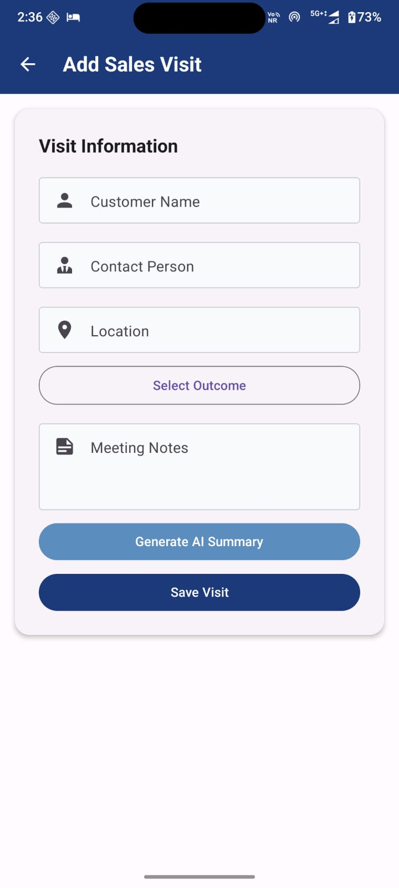
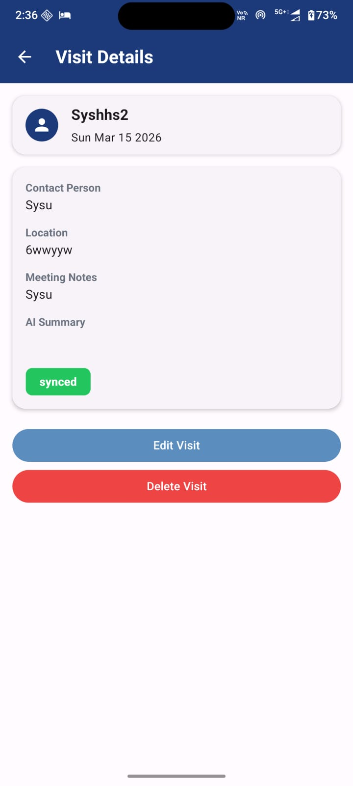
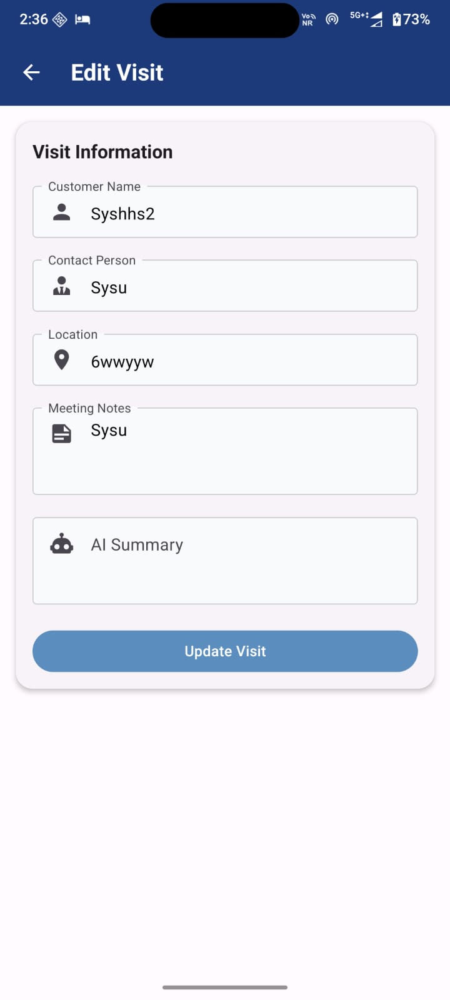
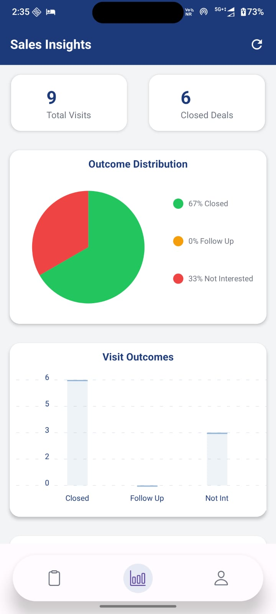
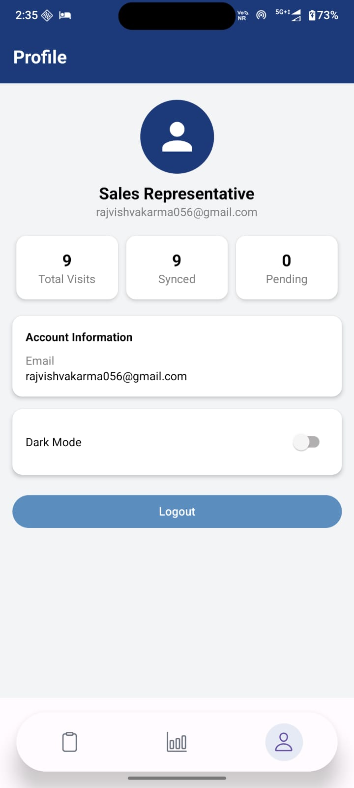
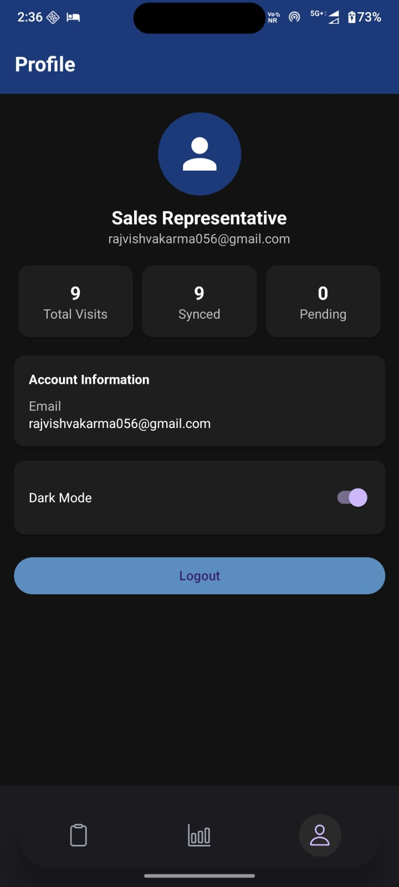

# Dealzy – AI Sales Visit Logger

Dealzy is a React Native (Expo) mobile app designed for sales teams to log customer visits, generate AI-powered meeting insights, and work seamlessly even without internet.

The app supports offline storage and automatic sync with Firebase when the network becomes available.

---

## Features

• Sales visit logging  
• AI-generated meeting summaries  
• Offline visit storage using AsyncStorage  
• Automatic sync to Firebase when internet returns  
• Manual retry sync for failed uploads  
• Dark mode UI support  
• Firebase Authentication for secure login  
• Swipe-to-delete visits  
• Filter visits (All / Synced / Pending)

---

## Tech Stack

**Frontend**

- React Native (Expo)
- TypeScript
- React Native Paper UI

**Backend**

- Firebase Authentication
- Firebase Firestore

**AI Integration**

- OpenRouter API
- LLaMA 3.1 AI Model

**Offline Support**

- AsyncStorage
- Custom Sync Engine

---

## App Architecture
Mobile App (React Native)
↓
Firebase Authentication
↓
Firestore Database
↓
Offline Storage (AsyncStorage)
↓
Auto Sync Engine

---

## Screens

- Login
- Signup
- Visit List Dashboard
- Add Visit
- Visit Details
- Edit Visit
- Insights
- Profile

---

## App Screenshots

  
  

  
  

  
  

  
  

  
  

## Installation

Clone the repository
git clone https://github.com/yourusername/dealzy.git

Navigate to the project folder

cd dealzy

Install dependencies

npm install

Start the Expo development server

npx expo start

Run the app on Android

Press "a" in terminal or scan QR using Expo Go

## Environment Variables

Add your OpenRouter API key inside:

AddVisit.tsx

Example:

const OPENROUTER_KEY = "your-api-key"

---

## Offline Sync System

When the device is offline:

1. Visits are saved in AsyncStorage
2. Status is marked as "draft"
3. When internet becomes available:
4. Visits automatically sync to Firebase
5. Status updates to "synced"

Users can also manually retry sync.

---

## Future Improvements

• Background auto-sync when internet reconnects  
• Image attachments for visits  
• Voice-to-text meeting notes  
• Sales analytics dashboard  
• Push notifications for follow-ups  

---

## Author

Raj Vishvakarma

---

## License

This project is created for internship assignment and educational purposes.

## 📱 Download APK

